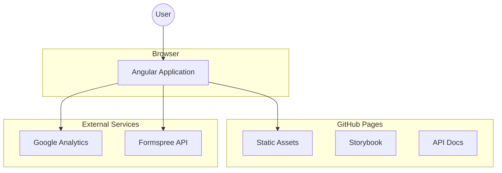
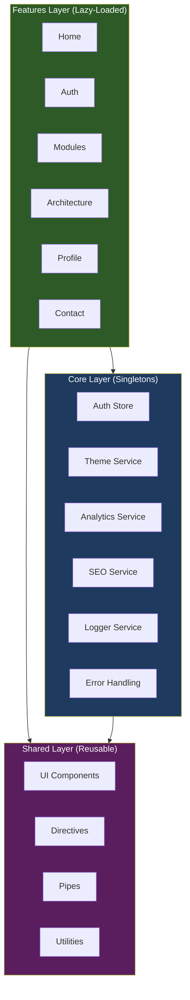
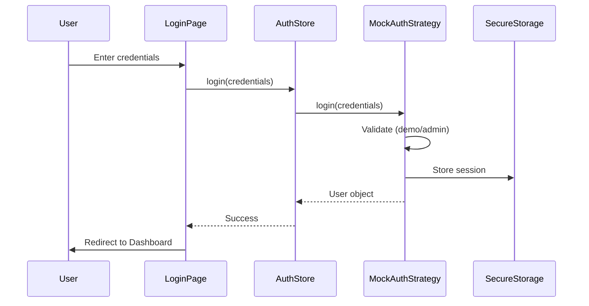
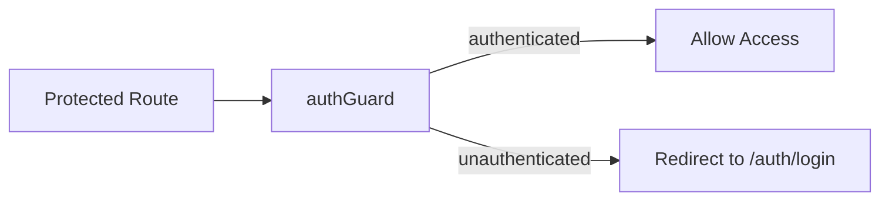

# 🏛️ Architecture Overview

This document provides a high-level overview of the Angular Enterprise Blueprint architecture, including diagrams, design decisions, and rationale.

---

## System Context

The application is a static SPA deployed to GitHub Pages with no backend dependencies (all data is mocked).



---

## Layered Architecture

The codebase follows a strict three-layer architecture with ESLint-enforced boundaries.



### Dependency Rules

| From     | To       | Allowed |
| -------- | -------- | ------- |
| Features | Core     | ✅      |
| Features | Shared   | ✅      |
| Features | Features | ❌      |
| Core     | Shared   | ✅      |
| Shared   | Core     | ❌      |
| Shared   | Features | ❌      |

These rules are enforced by `eslint-plugin-boundaries` in the ESLint configuration.

---

## State Management

The application uses NgRx SignalStore for reactive state management.

```mermaid
graph LR
    subgraph "Component"
        Template["Template"]
        Component["Component Class"]
    end

    subgraph "Store"
        State["State (Signals)"]
        Computed["Computed Signals"]
        Methods["Methods"]
    end

    subgraph "Service"
        API["HTTP Service"]
    end

    Template -->|reads| Computed
    Component -->|calls| Methods
    Methods -->|updates| State
    Methods -->|calls| API
    API -->|returns| Methods
    State -->|derives| Computed
```

### Stores in the Application

| Store             | Location                | Purpose                        |
| ----------------- | ----------------------- | ------------------------------ |
| AuthStore         | `core/auth`             | User authentication state      |
| DashboardStore    | `features/home`         | Dashboard metrics and visitors |
| ModulesStore      | `features/modules`      | Module catalog state           |
| ArchitectureStore | `features/architecture` | ADR documents state            |
| ContactStore      | `features/contact`      | Contact form submission state  |
| ProfileStore      | `features/profile`      | GitHub stats state             |

---

## Authentication Flow

The application uses a strategy pattern for authentication, allowing easy swap between mock and real implementations.



### Route Protection



---

## Folder Structure

```
src/app/
├── core/                    # Singletons (loaded once at app start)
│   ├── auth/               # Authentication (store, guards, strategies)
│   ├── config/             # Environment configuration
│   ├── error-handling/     # Global error handler, interceptors
│   ├── layout/             # Main layout, header, footer
│   └── services/           # Infrastructure services
│       ├── analytics/      # Analytics with provider pattern
│       ├── logger/         # Logging abstraction
│       ├── seo/            # SEO meta tags management
│       ├── storage/        # Secure storage service
│       └── theme/          # Theme management
│
├── features/               # Routed pages (lazy-loaded)
│   ├── home/              # Dashboard with metrics
│   ├── auth/              # Login page
│   ├── modules/           # Reference modules catalog
│   ├── architecture/      # ADR viewer
│   ├── profile/           # About the architect
│   └── contact/           # Contact form
│
├── shared/                 # Reusable components
│   ├── components/        # UI components (Button, Card, etc.)
│   ├── directives/        # Custom directives
│   ├── pipes/             # Custom pipes
│   └── utilities/         # Pure utility functions
│
├── app.config.ts          # Root providers
├── app.routes.ts          # Root routing
└── app.ts                 # Root component
```

---

## Theme System

The application supports 6 themes with CSS custom properties.

| Theme               | Category      | Description                 |
| ------------------- | ------------- | --------------------------- |
| Daylight            | Light         | Clean, professional default |
| Sunrise             | Light (Warm)  | Warm orange accents         |
| Midnight            | Dark          | Deep blue tones             |
| Twilight            | Dark (Cool)   | Cool purple accents         |
| High Contrast Light | Accessibility | Maximum contrast (light)    |
| High Contrast Dark  | Accessibility | Maximum contrast (dark)     |

Themes are managed by `ThemeService` and persisted to `localStorage`. The system also respects `prefers-color-scheme` and `prefers-reduced-motion` media queries.

---

## Architecture Decision Records

Major technical decisions are documented as ADRs and viewable in the running application at `/architecture`. Key decisions include:

- [ADR-001: Angular Framework Selection](https://moodyjw.github.io/angular-enterprise-blueprint/architecture/adr-001-angular-selection)
- [ADR-002: Standalone Components](https://moodyjw.github.io/angular-enterprise-blueprint/architecture/adr-002-standalone-components)
- [ADR-003: Signal-Based State](https://moodyjw.github.io/angular-enterprise-blueprint/architecture/adr-003-signal-state)
- [ADR-004: Mock Authentication](https://moodyjw.github.io/angular-enterprise-blueprint/architecture/adr-004-mock-auth)

See the full list in the application or in `src/assets/docs/`.

---

## Further Reading

- [Implementation Plan](docs/PLAN.md) – Detailed phase-by-phase roadmap
- [Coding Standards](docs/CODING_STANDARDS.md) – TypeScript and Angular conventions
- [Security Checklist](docs/SECURITY_CHECKLIST.md) – Security testing guidelines
- [Blog Series](blogs/) – In-depth articles on each phase
